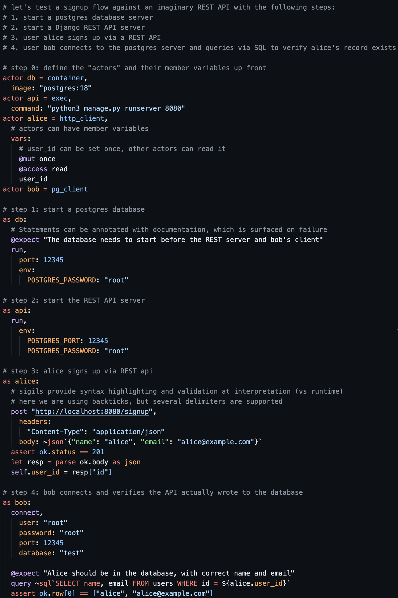

# iLL - integration Logic Language

Having testing troubles? It's time to get iLL!

* [Roadmap](design/ROADMAP.md)
* [Supported Actors and Systems](#supported-actors-and-systems)
* [Comparison with existing systems](#comparison-with-existing-systems)
* [Concepts](#concepts)
* [FAQ](#faq)

## What is iLL?

iLL is a scripting language for multi-actor, multi-system integration testing. 

Here is what it looks like:


iLL is inspired by the [actor model](https://en.wikipedia.org/wiki/Actor_model), [sqllogictest](https://sqlite.org/sqllogictest/doc/trunk/about.wiki), [Rust](https://rust-lang.org/), and [MuonTrap](https://github.com/fhunleth/muontrap). It was created for the development and testing of [SQLync](https://www.sqlync.com).

## Supported Actors and Systems

Each `.ill` file is a single test. The following "actors" are currently targeted:

| Actor | Description | Examples | Implemented |
| --- | --- | --- | --- |
| exec | Shell command | [examples/exec/](examples/exec/) | ✅ |
| pg_client | Postgres client | [examples/pg_client/](examples/pg_client/) | ⬜ |
| rest | REST client | [examples/rest/](examples/rest/) | ⬜ |
| mqtt | MQTT client | [examples/mqtt/](examples/mqtt/) | ⬜ |
| container | Docker container | [examples/container/](examples/container/) | ✅ |
| args | Command-line arguments | [examples/built-in/args.ill](examples/built-in/args.ill) | ⬜ |

Some language specific dockerfile examples are available at [examples/container/languages/](examples/container/languages/) or you could just run with the exec actor. More concrete examples to come on this.

## Usage

```
ill test [paths...]   Run .ill test files and report pass/fail
ill check [paths...]  Validate .ill files without running them
```

Both commands accept any mix of files and directories. Directories are searched recursively for `.ill` files. With no arguments, the current directory is searched.

`ill check` reports all diagnostics (errors, warnings, hints) and exits non-zero if there are any errors. It's useful for CI linting or editor integration before a full test run.

## Comparison with existing systems

### Sqllogictest

Sqllogictest is the standard for SQL correctness testing. Its documentation states: "Sqllogictest is concerned only with correct results" — which it does very well. You can write queries and assert on them, but it stops there. Integrating sqllogictest snippets into a larger test suite is possible but clunky, for example: tying back a failure in a snippet to your test suite or needing to recompile before running tests.

iLL extends sqllogictest's statement-assertion model into full bring-up, test, and teardown for systems beyond SQL.

## Concepts

### Actors

Interactions in iLL are performed by actors. Actors have their own contained state expressed with member variables and the actor's mode. 

### Member Variables

Actors have member variables, much like classes or structs in other languages. The member variables can have different visibility and mutability depending on annotations in their actor definitions.

### Modes

Different actor types (ex: postgres client, bash, mqtt, etc.) offer different actions depending on what "mode" they are in. For example, a postgres client may be in a "disconnected" mode and unable to run queries until it connects to a postgres server, at which point it will be in a "connected" mode and able to run queries. The iLL compiler is aware of this transition and can provide useful functionality like catching errors at compile time and providing hints to IDEs.

## FAQ

### Why not just use Python (ruby, etc.)?

One of the goals of iLL is to allow you to write your tests more like the systems they integrate with and less like a client library of language X.

Controlling the grammar lets us give much richer features, like more compile time checks, highlighting and parsing of SQL statements, custom assertions, and (eventually) better error messages. By not using an existing language we also annoy everybody equally.

The drawbacks are real, including:
* having to learn a new grammar
* not supporting custom scripting (ex: for loops)
* supporting new clients may require changing the language (until integrations / extensions are implemented). The suggested workaround is to make a REST service that wraps your use case.

As the language evolves we'll see what's really useful to add. For now, the focus is seen as a benefit.


### How do I inject faults?

This is up to you for now. If I think of a good way to work it into the language I will.


### Something something, what about AI?

Lots of possibilities. One really promising one is having AI generate .ill tests to break your system, then you have a repeatable, understandable way to replicate.

### What is SQLync?

Check the website. If there isn't much there look again later.

## Contributing

The current purpose of iLL is to test SQLync, but that may expand. I'm not accepting public contributions yet, but if you want to help or just chat feel free to get in touch.

## License

iLL is licensed under the Apache License, Version 2.0
